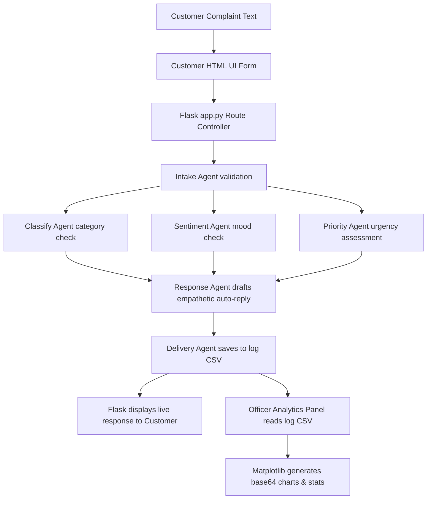

# 🤖 AI-Powered Customer Complaint Analyzer and Response Generator

An intelligent, Generative AI-driven multi-agent system designed to automate the ingestion, classification, sentiment analysis, priority detection, and response generation for customer complaints. The system processes raw complaint text, extracts key metadata, saves record logs in a local datastore, and provides a rich analytics dashboard for officers and customer support managers.

---

## 📌 Table of Contents
- [Key Features](#-key-features)
- [Technology Stack](#-technology-stack)
- [Directory Layout](#-directory-layout)
- [System Architecture & Workflow](#-system-architecture--workflow)
- [Installation & Setup](#-installation--setup)
- [Running the Project](#-running-the-project)
- [User Roles & Flows](#-user-roles--flows)

---

## ✨ Key Features

### 1. Multi-Agent Analysis Pipeline
Incoming complaints are routed through a series of specialized AI agents:
- **Intake Agent**: Standardizes and validates the incoming fields.
- **Classification Agent**: Categorizes the issue (Billing, Delivery, Product Quality, Customer Service, Technical, or Other).
- **Sentiment Agent**: Assesses the customer's mood (Angry, Frustrated, Disappointed, Neutral, or Concerned).
- **Priority Agent**: Assesses the urgency (High, Medium, Low) based on emotional severity, legal risk, or system failures.
- **Response Agent**: Drafts an empathetic, professional email/chat reply that addresses high-priority escalations immediately.

### 2. CSV Persistence & Management
All generated analysis outputs and metadata are handled by a dedicated delivery agent and logged in a structured local CSV file. The admin dashboard allows management to download this history log or delete resolved tickets.

### 3. Executive Officer Analytics Dashboard
Visualizes customer sentiment distributions, category counts, and high-priority alarms in real-time, complete with dynamically generated statistical charts.

---

## 🛠️ Technology Stack

| Layer | Technology | Purpose |
| :--- | :--- | :--- |
| **Frontend UI** | [Bootstrap 5](https://getbootstrap.com/) / Vanilla CSS | Clean, modern, responsive CSS templates utilizing Bootstrap Icons. |
| **Backend Framework** | [Flask](https://flask.palletsprojects.com/) | Python web server handling routing, session roles, authentication, and core workflow controller. |
| **Generative AI Engine** | [Google Generative AI](https://ai.google.dev/) (Gemini 2.5 Flash) | Context classification, sentiment evaluation, prioritization, and conversational response generation. |
| **Data Engine** | [Pandas](https://pandas.pydata.org/) | Parsing, modifying, and logging complaints in `data/complaint_log.csv`. |
| **Data Visualization** | [Matplotlib](https://matplotlib.org/) (`Agg` non-interactive backend) | Rendering distribution bar charts, encoded as base64 strings directly in HTML. |
| **Environment Config** | [python-dotenv](https://github.com/theofidry/django-dotenv) | Loads environment keys safely from a local `.env` file. |

---

## 📂 Directory Layout

*   [app.py](file:///d:/addon_capstone_project/app.py) — Core Flask application routes, server entry, and chart graphics controllers.
*   [agents/](file:///d:/addon_capstone_project/agents) — Multi-agent components folder:
    *   [intake.py](file:///d:/addon_capstone_project/agents/intake.py) — Input extraction and sanity checks.
    *   [classify.py](file:///d:/addon_capstone_project/agents/classify.py) — Topic classifier agent.
    *   [sentiment.py](file:///d:/addon_capstone_project/agents/sentiment.py) — Sentiment tracker agent.
    *   [priority.py](file:///d:/addon_capstone_project/agents/priority.py) — Priority/severity assessor agent.
    *   [response.py](file:///d:/addon_capstone_project/agents/response.py) — Auto-responder writer agent.
    *   [delivery.py](file:///d:/addon_capstone_project/agents/delivery.py) — Data handler for loading, logging, and deleting records from the CSV file.
*   [templates/](file:///d:/addon_capstone_project/templates) — UI views:
    *   [login.html](file:///d:/addon_capstone_project/templates/login.html) — Portal gate page.
    *   [customer.html](file:///d:/addon_capstone_project/templates/customer.html) — Submission form for customers.
    *   [officer.html](file:///d:/addon_capstone_project/templates/officer.html) — Dynamic officer analytics panel and database log manager.
*   [requirements.txt](file:///d:/addon_capstone_project/requirements.txt) — Python dependency manifest.

---

## ⚙️ System Architecture & Workflow



---

## 🚀 Installation & Setup

### 1. Clone the Repository
```bash
git clone https://github.com/oliviaplasid04-ops/add_on.git
cd add_on
```

### 2. Set Up a Virtual Environment
```bash
# On Windows
python -m venv venv
venv\Scripts\activate

# On macOS/Linux
python3 -m venv venv
source venv/bin/activate
```

### 3. Install Dependencies
```bash
pip install -r requirements.txt
```

### 4. Configure Environment Variables
Create a file named `.env` in the root project directory:
```env
SECRET_KEY=yoursecretkeyhere
OFFICER_PASSWORD=officer123
GOOGLE_API_KEY=AIzaSy...YourActualGeminiApiKey...
```

---

## 🏃 Running the Project

Launch the local web server:
```bash
python app.py
```

Once running, navigate to `http://127.0.0.1:5000` in your web browser.

---

## 👥 User Roles & Flows

### 🔓 Customer Portal
1. Select **Login as Customer** from the portal main gate.
2. Enter your Name and Complaint details.
3. Submit the form to trigger the backend agent chain.
4. View your instant AI-generated response alongside the assigned priority level.

### 🛡️ Officer Dashboard
1. Select **Login as Officer** and enter the `OFFICER_PASSWORD` (default: `officer123`).
2. Review system-wide analytics:
    * Total logged complaints and high-priority alarms count.
    * Real-time Matplotlib charts displaying category and priority distribution.
3. Browse the complete records table, delete items from log, or click **Download CSV** to export the entire history list.
