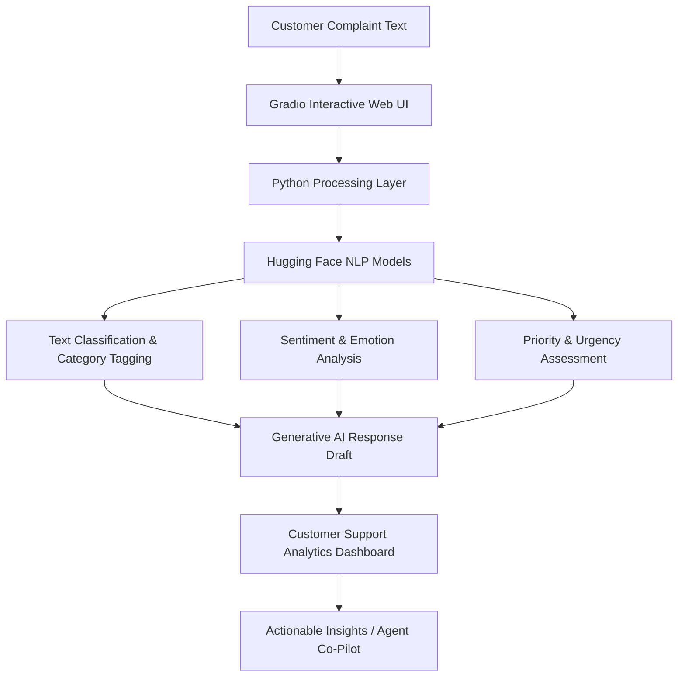

# 🤖 AI-Powered Customer Complaint Analyzer and Response Generator

[](https://www.python.org/)
[](https://gradio.app/)
[](https://huggingface.co/)
[](https://opensource.org/licenses/MIT)

An intelligent, Generative AI-driven system designed to automate the ingestion, analysis, and response generation for customer complaints. By leveraging Natural Language Processing (NLP) techniques, this system classifies issue categories, detects sentiment, determines urgency/priority levels, and drafts context-aware responses to streamline support workflows.

---

## 📌 Table of Contents
- [Overview](#-overview)
- [Problem Statement](#-problem-statement)
- [Objectives](#-objectives)
- [Key Features](#-key-features)
- [System Architecture & Workflow](#-system-architecture--workflow)
- [Technology Stack](#-technology-stack)
- [Installation](#-installation)
- [Running the Project](#-running-the-project)
- [Usage & Sample Examples](#-usage--sample-examples)
- [Future Enhancements](#-future-enhancements)
- [Target Applications](#-target-applications)

---

## 🔍 Overview

In the modern enterprise, customer support teams are often overwhelmed with high volumes of incoming complaints from emails, support tickets, and contact forms. 

The **AI-Powered Customer Complaint Analyzer and Response Generator** automates this pipeline. Using state-of-the-art NLP models, the system processes raw text inputs to extract critical metadata (such as category, sentiment, and priority) and generates helpful draft responses, enabling support agents to resolve tickets faster with data-driven insights.

---

## ⚠️ Problem Statement

Manually reviewing, tagging, prioritizing, and drafting individual responses for thousands of customer complaints daily is a massive bottleneck. This manual triage leads to:
* 🕒 Increased response time and customer dissatisfaction.
* 📈 Human error in classification and priority assessment.
* 💼 High workload and burnout for support representatives.

This project addresses these challenges by introducing a Generative AI assistant that acts as a co-pilot for customer service representatives.

---

## 🎯 Objectives

1. **Automate Triage:** Classify incoming customer complaints automatically based on issue types.
2. **Sentiment Analysis:** Assess the emotional state (frustrated, neutral, negative, positive) of the customer.
3. **Priority Detection:** Flag high-priority issues (like payment or security failures) for immediate escalation.
4. **Draft Automation:** Generate polite, contextually relevant response drafts using Generative AI.
5. **Team Dashboard Insights:** Provide support managers with analytics on recurring complaints and distribution trends.

---

## ✨ Key Features

### 1. Complaint Analysis
* Accepts unstructured complaint text directly.
* Processes, cleans, and extracts key contextual information.

### 2. Intelligent Categorization
Automatically labels complaints into standard departments:
* 💳 **Payment & Billing Issues** (e.g., failed transactions, double charges)
* 📦 **Delivery & Logistics Problems** (e.g., delayed orders, missing items)
* 🛠️ **Technical Bugs** (e.g., application crashes, login issues)
* 🛍️ **Product Quality Issues** (e.g., damaged goods, malfunctioning features)
* 🔐 **Account & Security Issues** (e.g., locked accounts, password reset failure)

### 3. Sentiment Analysis
Detects customer emotions to tailor response tone:
* 🔴 **Frustrated/Angry**
* 🟡 **Negative**
* ⚪ **Neutral**
* 🟢 **Positive**

### 4. Dynamic Priority Detection
Tags complaints with an urgency level:
* 🔥 **High Priority** (e.g., Payment failures, double charging)
* ⚡ **Medium Priority** (e.g., Missing package updates)
* ❄️ **Low Priority** (e.g., General feedback, feature requests)

### 5. AI Response Generation
Generates context-aware customer-facing email and chat responses using Hugging Face/Generative AI models.

### 6. Interactive Analytics Dashboard
Visualizes key metrics such as:
* Total complaint count
* Breakdown of complaint categories
* Sentiment distribution
* Average response generation metrics

---

## ⚙️ System Architecture & Workflow

The workflow below illustrates the step-by-step processing of a customer complaint:



### Text Flow:
```
Customer Complaint
       │
       ▼
Gradio Interface
       │
       ▼
Python Processing Layer
       │
       ▼
Hugging Face NLP Models
       │
       ▼
Classification + Sentiment Analysis
       │
       ▼
Generative AI Response Generation
       │
       ▼
Customer Support Insights
```

---

## 🛠️ Technology Stack

| Layer | Technology | Purpose |
|---|---|---|
| **Frontend** | [Gradio](https://gradio.app/) | Interactive web UI for text inputs, file uploads, and displaying model predictions/responses. |
| **Backend** | [Python](https://www.python.org/) | Data pipeline execution, prompt orchestration, and overall backend service logic. |
| **NLP & AI** | [Hugging Face Transformers](https://huggingface.co/docs/transformers/index) | Pre-trained and fine-tuned models for classification, sentiment, and text generation. |
| **Data Processing** | [Pandas](https://pandas.pydata.org/) | Dataset manipulation, tabular analysis, and metrics aggregation. |
| **Visualization**| [Plotly](https://plotly.com/) / [Matplotlib](https://matplotlib.org/) | Generating charts and interactive dashboard visualizations. |

---

## 🚀 Installation

### 1. Clone the Repository
```bash
git clone https://github.com/your-username/customer-complaint-analyzer.git
cd customer-complaint-analyzer
```

### 2. Set Up a Virtual Environment (Recommended)
```bash
# On Windows
python -m venv venv
venv\Scripts\activate

# On macOS/Linux
python3 -m venv venv
source venv/bin/activate
```

### 3. Install Dependencies
```bash
pip install -r requirements.txt
```

---

## 🏃 Running the Project

Launch the local web server hosting the Gradio interface:

```bash
python app.py
```

After running the command, open the local URL printed in your console (usually `http://127.0.0.1:7860`) in your web browser.

---

## 📊 Usage & Sample Examples

### Scenario Example

#### **Input (Customer Complaint):**
> *I was charged twice for my order and my refund has not arrived.*

#### **Analyzed Output:**
* **Category:** Payment Issue
* **Sentiment:** Negative
* **Priority:** High
* **Generated Response:**
  > "We sincerely apologize for the inconvenience caused. Our team will verify the transaction details immediately and expedite your refund process. We appreciate your patience."

---

## 🔮 Future Enhancements

* ✉️ **Email Server Integration:** Automatically fetch complaints from support inboxes and draft replies directly.
* 💬 **Omnichannel Chatbots:** Integrate analyzer logic into web widgets, WhatsApp, and Telegram.
* 🌐 **Multilingual Support:** Translate and analyze complaints written in languages other than English.
* 🎫 **Automated Ticketing:** Integrate with platforms like Zendesk or Jira to auto-generate and assign tickets.
* 🎙️ **Voice Processing:** Transcribe customer support phone logs and feed them directly into the analyzer.

---

## 🏢 Target Applications

* 🛒 **E-Commerce & Retail Platforms**
* 🏦 **Banking & Financial Service Providers**
* 📱 **Telecommunication Networks**
* 💻 **SaaS & Enterprise Software Companies**
* 📞 **Dedicated Customer Support Centers**

---

## 👥 Team & Acknowledgments

Developed as a Generative AI project using cutting-edge NLP technologies, Hugging Face models, and Python visualization toolkits.
